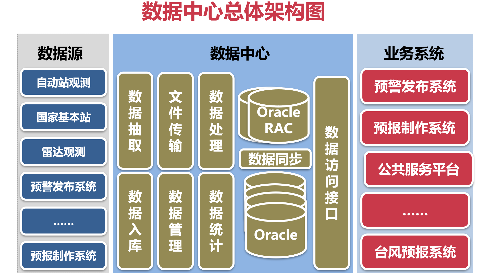
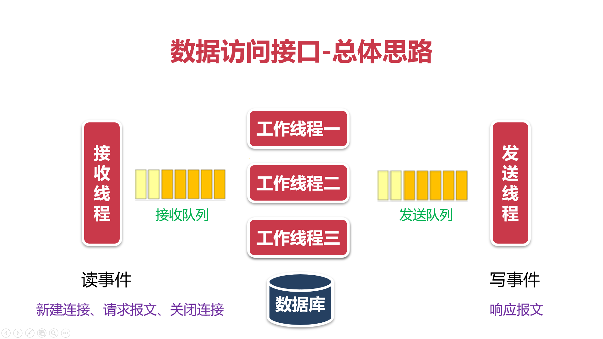
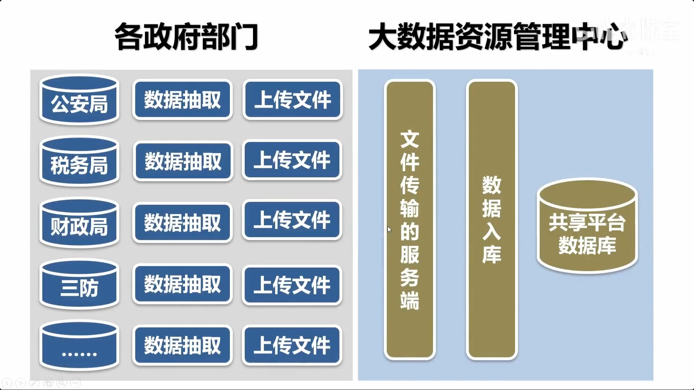
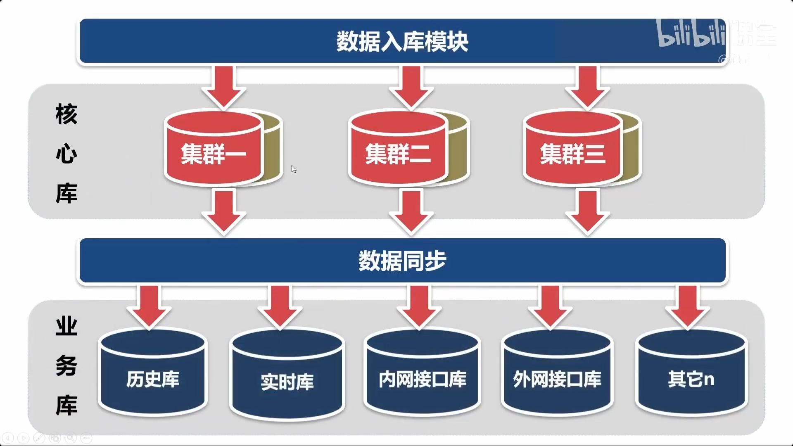
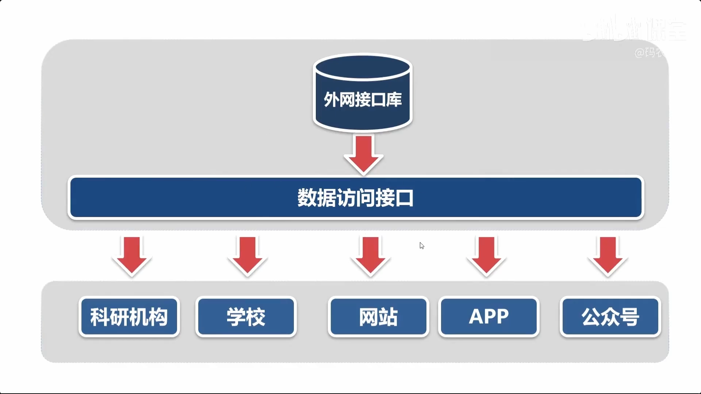

# A-项目描述

南京市气象局有上百个观测系统和业务系统，产生的观测数据和服务产品分散在各系统中，不方便共享。数据中心的功能是从各业务系统中采集数据，加工处理后，统一存储在Oracle数据库中，业务系统可以直连Oracle数据库，用SQL语句查询数据，也可以通过数据访问接口获取数据。




# B-各模块功能

## 1-数据抽取模块

**描述**：

1. 用于从数据源的数据库中抽取数据，生成xml文件
2. 这是一个通用的功能模块，通过配置脚本，就可以从不同的表中抽取数据
3. 支持全量抽取（每次抽取全部的数据）和增量抽取（每次只抽取新增的数据）
4. 支持Oracle、MySQL和SQL Server数据库。 本人做的是Oracle数据库，其它数据库的部分由有其他同学和师兄负责。

**细节**:

## 2-基于ftp协议的文件传输模块

**描述**：

1. 采用ftp协议，从ftp服务端下载/上传文件；
2. 这是一个通用的功能模块，通过配置脚本，就可以实现文件下载/上传任务；
3. 把开源的ftp客户端库ftplib.c封装成C++的类，使用起来更方便；
4. 支持增量传输的功能，每次只下载/上传新增的文件；
5. 适用于不同的业务系统之间传输文件。

**细节**:

## 3-基于tcp协议的文件传输模块

**描述**:

1. 自定义tcp通讯协议，实现了文件传输的服务端和客户端程序，支持文件下载/上传功能。
2. 这是一个通用的功能模块，通过配置脚本，就可以实现文件下载/上传任务；
3. 采用了异步通讯的方式，传输文件的效率非常高，远超过ftp协议；
4. 支持增量传输的功能，每次只下载/上传新增的文件；
5. 适用于同一个业务系统的多个服务器之间传输文件。

**细节** :

## 4-数据入库模块

**描述**：

1. 把数据抽取模块和数据处理模块生成的xml文件存储到Oracle数据库中；
2. 这是一个通用的功能模块，通过配置脚本，就可以实现不同种类数据的入库；
3. 根据xml文件名识别数据种类（需要入库的表），查询Oracle的数据字典，得到表的字段名，用字段名解析xml文件，获取数据，把数据入库到表中。

**details** :

## 5-数据管理模块

**描述**：

1. 大部分的数据可分为热数据和冷数据，在气象行业中，历史数据属于冷数据，数据管理模块的功能是把冷数据删除、备份或归档。
2. 数据管理是通用的功能模块，通过配置脚本，就可以实现对不同数据表的管理。

**details** :

## 6-数据同步模块

**描述**：
数据中心的数据库是一个集群，核心数据库采用RAC，应用数据库是若干个单实例，核心数据库负责处理数据，应用数据库负责提供数据服务。

1. 数据同步是指把核心数据库中的数据同步到应用数据库中；
2. 这是一个通用的功能模块，通过配置脚本，就可以实现不同表的同步；
3. 利用了Oracle的dblink和数据字典；
4. 支持刷新同步，全表刷新和按条件刷新；
5. 支持增量同步，只同步新增的数据；
6. 支持不同表结构的同步（源表和目的表的表结构不同）；
7. 可以指定同步数据的条件。

**details** :

## 7-数据处理模块和数据统计模块（由其他同学和师兄完成）

略.

## 8-数据访问接口模块

**描述**：

1. 采用http协议，为业务系统提供数据服务；
2. 这是一个通用的功能，通过配置参数，就可以实现不同的数据访问接口；
3. 服务端程序采用了线程、线程通讯、管道、智能指针和epoll等技术；
4. 数据访问接口性能瓶颈在Oracle数据库，并发性能在3-5千/秒左右。
5. 服务端程序的总体结构如下：




**details** :

# C-三大功能模块回顾

本项目为**数据共享平台**, 以气象站的数据为例。

- **（一）测试用到的两种数据：**

1. 全国气象站点参数(idc/ini/stcode.ini)
2. 全国气象站点观测数据(需要写程序生成，生成后的数据存放于文件中，cvs,xml,json三种文件格式)。一个气象站每隔一分钟观测一次，并产生一条数据；共有839个站点，一分钟产生839条数据

- **（二）项目目录**

1. public下为通用项目框架，可用于任意项目
2. 共享平台专用程序放在/project/idc/cpp (4个.cpp)
3. 通用模块放到/projec/tools/cpp(20个.cpp)，如监控调度模块

- **（三）模块通用要求**

每个程序都要：

1. 参数检查并提供使用帮助
2. 程序退出处理
3. 日志记录

## 1-数据采集与数据入库




## 2-数据同步




## 3-数据访问接口




# D-技术补充

## 1-daemon守护进程

- **`procctl` 调度程序运行逻辑**

你当前文件 procctl.cpp 已经一目了然，整个流程如下：

1. 参数检查：
   - `argc < 3` 时打印用法并退出（必须传 `restart_time program [argv...]`）。

2. 关闭信号和IO：
   - `for (ii=0; ii<64; ii++) signal(ii, SIG_IGN);`
   - `close(ii);`
   - 目的是让调度程序自己不受外部信号/终端IO干扰，做守护进程。

3. 变成后台守护进程：
   - `fork()`，父进程 `exit(0)`，子进程继续。
   - 子进程恢复 `SIGCHLD` 为默认（`signal(SIGCHLD, SIG_DFL)`），这样可 `wait` 子进程防僵尸。

4. 构造被调度程序参数（给 `execv`）：
   - `pargv` 从 `argv[2]...argv[argc-1]` 复制，末尾 `nullptr`。

5. 主循环（生命周期核心）：
   - `while(true)`：
     - `fork()` 一个子进程：
       - 子进程 `execv(argv[2], pargv)` 启动目标程序（脚本/可执行）。
       - 若 `execv` 失败（才回到后面）`exit(0)`。
     - 父进程 `wait(&status)` 等子进程结束。
     - `sleep(atoi(argv[1]))` 等待 `restart_time` 秒。
   - 回到循环，重复启动下一个子进程。

---

**关键行为**

- 每次被调度程序退出后等待 `restart_time` 秒再重启。
- 如果被调度程序是长期驻留程序，`restart_time` 可设较小（<5）。
- `procctl` 本身在 `kill` 后不容易被干掉（除非 `kill -9`, 但子进程可被正常管理）。

- **为什么守护进程 `procctl` 不直接 `execv`，而是再 `fork` 子进程？**

很好问题！这里逻辑很清晰：`procctl` 本身是调度器，`daemon` 进程负责“监控 + 重启”，不能被替换成目标程序。

1. **守护进程身份与管理职责分离**

- `procctl` 经过第一阶段 `fork` + `exit` 变成后台守护进程（只负责调度循环）。
- 守护进程不能直接 `execv` 目标程序，否则它的进程地址空间被替换，调度逻辑就没了，后续就没办法重新启动程序了。

2. **需要循环重启：必须保持父调度进程活着**

- `while(true)` 内每次用 `fork` 出子进程运行目标程序。
- 子进程 `execv(argv[2], pargv)`：只负责执行被调度程序，进程退出后结束。
- 父（守护）进程 `wait` 子进程，`sleep(restart_time)`，然后再次 `fork` 重启。

3. **子程序退出不影响调度器**

- 子进程退出只给父进程一个终止信号，父进程能 `wait` 清僵尸。
- 如果守护进程自己 `execv`，这种“监控-等待-重启”逻辑无法完成。

> 结论：守护进程本身是控制循环和周期的“监工”，被调度程序必须在独立子进程中运行，完成后由守护进程再启动下一次。

## 2-ftp配置

- **ftp服务端**

1. 安装服务端与客户端(lftp)

```bash
sudo pacman -S vsftpd lftp
```

2. 服务端配置文件

```bash
# sudo nvim /etc/vsftpd.conf
# ========== basic ==========
anonymous_enable=NO
local_enable=YES
write_enable=YES

# ========== security ==========
chroot_local_user=YES
allow_writeable_chroot=YES

# ========== inactive mode ==========
pasv_enable=YES
pasv_min_port=30000
pasv_max_port=31000

# ========== log ==========
xferlog_enable=YES
log_ftp_protocol=YES
```

3. 创建ftp用户（隔离）

```bash
sudo useradd -m ftpuser
sudo passwd 225166
```

4. 权限配置

```bash
mkdir -p /home/ftpuser/files
chown ftpuser:ftpuser /home/ftpuser/files
```

5. 启动vsftpd服务

```bash
sudo systemctl enable --now vsftpd
```

6. 防火墙配置nftables

```bash
# sudo nvim /etc/nftables.conf
tcp dport 21 accept
tcp dport 30000-31000 accept
```

7. ftp服务调试指令

```bash
journalctl -u vsftpd -f
```

- **客户端lftp**

1. 连接

```bash
lftp ftp://ftpuser@192.168.1.10
```

2. 收发文件, 远程部署

```bash
get file
put file
```

远程自动部署

```bash
# 上传: 本地 build/ → 远程目录build
mirror -R build/ /remote/build/
# 下载：
mirror /remote/logs/ ./logs/
```

参数：

- 增量同步：`--only-newer`
- 并行传输：`--parallel=4`
- 删除远程多余文件，与本地完全镜像：`--delete`

3. 写成脚本或使用makefile

**deploy.sh**

```bash
#!/bin/bash

HOST=192.168.1.10
USER=ftpuser

lftp -e "
set ftp:passive-mode on
mirror -R build/ /srv/app/
bye
" ftp://$USER@$HOST
```

**makefile**

```bash
FTP_HOST=192.168.1.10
FTP_USER=ftpuser

deploy:
	lftp -e "\
	set ftp:passive-mode on; \
	mirror -R --only-newer --parallel=4 --delete build/ /srv/app/; \
	bye" ftp://$(FTP_USER)@$(FTP_HOST)
```

4. 配置 ~/.lftprc（长期优化）

```bash
set ftp:passive-mode on
set net:max-retries 3
set net:timeout 10
```

## 3-IO多路复用

**多进/线程的网络服务端**

- 为每个客户端连接创建一个进/线程，消耗的资源很多。

* 1核2GB的虚拟机，大概可以创建一百多个进/线程。

**IO多路复用的服务端**

- 用一个进/线程处理多个 TCP 连接，减少系统开销。
- 三种模型：select (1024)、poll (数千) 和epoll (百万)。

**网络通讯-读事件**

1. 已连接队列中有已经准备好的socket（有新的客户端连上来）
2. 接收缓存中有数据可以读（对端发送的报文已到达）
3. tcp连接已断开（对端调用close()函数关闭了连接）

**网络通讯-写事件**

- 发送缓冲区没有满，可以写入数据（可以向对端发送报文）。

**水平触发**

- 读事件：如果epoll_wait触发了读事件，表示有数据可读，如果程序没有把数据读完，再次调用epoll_wait的时候，将立即再次触发读事件。
- 写事件：如果发送缓冲区没有满，表示可以写入数据，只要缓冲区没有被写满，再次调用epoll_wait的时候，将立即再次触发写事件。

**边缘触发**

- 读事件：epoll_wait触发读事件后，不管程序有没有处理读事件，epoll_wait都不会再触发读事件，只有当新的数据到达时，才再次触发读事件。
- 写事件：epoll_wait触发写事件之后，如果发送缓冲区仍可以写（发送缓冲区没有满），epoll_wait不会再次触发写事件，只有当发送缓冲区由 **满** 变成 **不满** 时，才再次触发写事件。

## 4-阻塞与非阻塞IO

- 阻塞：在进/线程中，发起一个调用时，在调用返回之前，进/线程会被阻塞等待，等待中的进/线让出CPU的使用权。
- 非阻塞：在进/线程中，发起一个调用时，会立即返回。
- 会阻塞的四个函数：connect()、accept()、send()、recv()

set_nonblocking: `fcntl()`

**阻塞&非阻塞IO的应用场景**

- 在传统的网络服务端程序中 (每连接每线/进程) ，采用阻塞IO。
- 在IO复用的模型中，事件循环不能被阻塞在任何环节，所以，应该采用非阻塞IO。

**非阻塞IO-connect()**

- 对非阻塞的IO调用connect()函数，不管是否能连接成功，connect()都会立即返回失败，`errno== EINPROGRESS`
- 对非阻塞的IO调用connect()函数后，如果socket的状态是可写的，证明连接是成功的，否则是失败的。

**非阻塞IO-accept()**

- 对非阻塞的IO调用accept()，如果已连接队列中没有socket，函数立即返回失败，`errno==EAGAIN`

**非阻塞IO-recv()**

- 对非阻塞的IO调用recv()，如果没数据可读（接收缓冲区为空），函数立即返回失败，`errno==EAGAIN`

**非阻塞IO-send()**

- 对非阻塞的IO调用send()，如果socket不可写（发送缓冲区已满），函数立即返回失败，`errno==EAGAIN`

## 5-网络代理

- A想要访问C, 必须靠运行在B中的代理程序中转；
- B暴露给AC的端口可以不同。

- 正向代理：A->B, B->C,但是AC不可访问。可在B上部署正向代理程序，使得A->C;
- 反向代理：A->B, C->B,但是B不可访问AC。但使用反向代理实现。
- forward-proxy on behalf of client; reverse-proxy on behalf of backend-server.

```txt
client -> forward-proxy -> server

                        -> server1
                       |
client -> reverse-proxy -> server2
                       |
                        -> server3
```

## 6-定时器

> 定时器用于执行定时任务，例如清理空闲的tcp连接。

- 传统做法：alarm()函数可设置定时器，触发SIGALRM信号。
- 在epoll中：Linux内核把定时器和信号抽象为fd，让epoll统一监视。

```cpp
// legacy style
void alarmfunc(int sig){
  if (sig == SIGALRM){
    cout << "收到了定时器信号。\n";
  }
  alarm(10); // start, alarm after 10s
}

int main(int argc, char *argv[]){
  signal(SIGALRM, alarmfunc);
  alarm(10); // start, alarm after 10s
  while (true){
    cout << "sleep中\n";
    sleep(5);
  }
}

// epoll style
```
