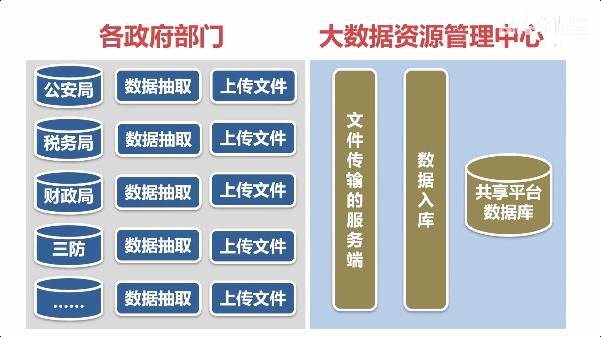
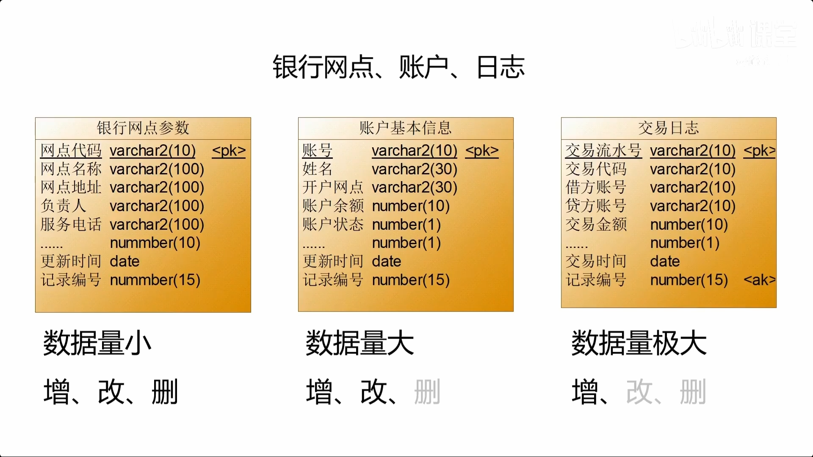
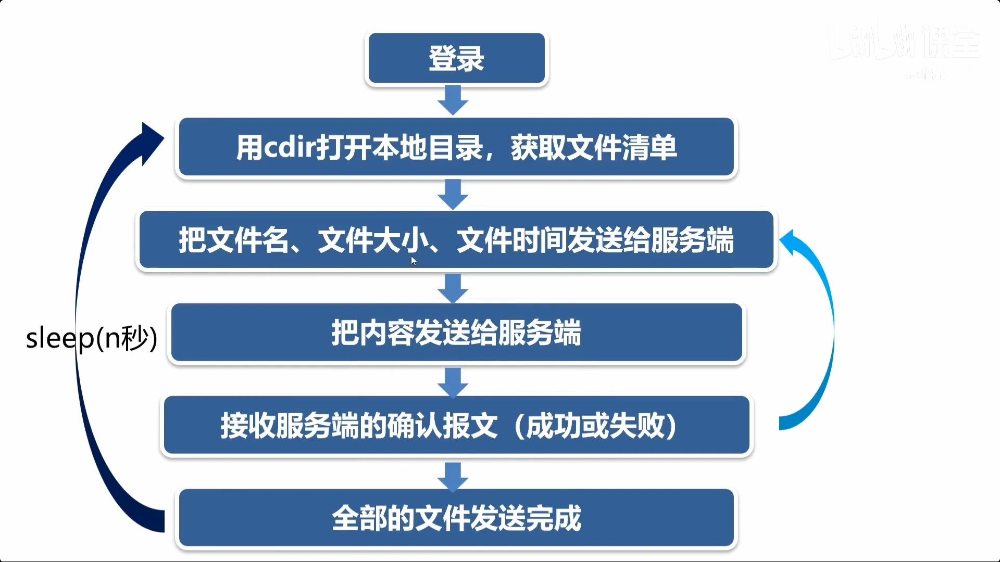
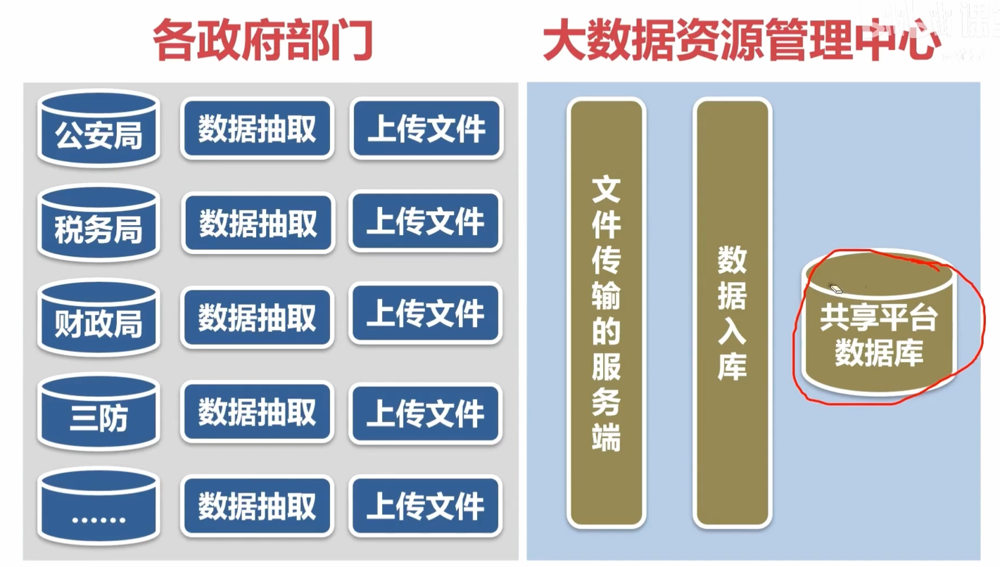
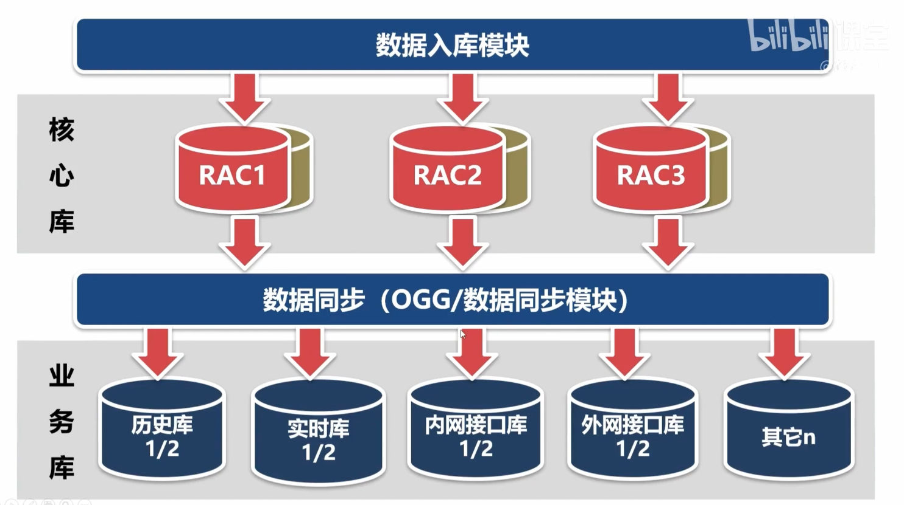
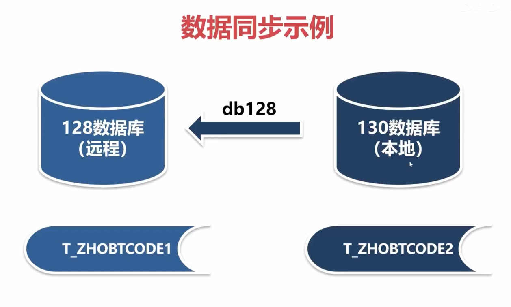

# 一、idc主程序

## （一）生成观测数据

根据站点参数stcode.ini生成站点的观测数据

- 读取stcode.ini中的每一行，拆分字段放入stlist容器
- 根据stlist中的参数生成观测数据,并放入datalist容器
- 根据datalist容器中的观测数据写入csv,xml,json三种文件

# 二、basic: 程序的监控与调度

**要解决的问题：**

1. 让监控程序周期性运行一些调度任务；
2. 检查服务程序是否活着；
3. 如果服务程序已经终止，重启它。

**两种服务程序:**

1. 周期性运行的：如，每一分钟要运行一次，生成一次测试数据； ===> 周期性启动
2. 常驻服务：如，网络通讯服务，不间断7x24运行 ===> 正常/异常终止后, 重启它。
   （要终止服务，同时killall -9 调度程序+服务程序本身）

## （一）三个部分：调度，心跳，监控

1. 调度模块procctl.cpp (守护进程daemon)
2. 进程心跳(写进了项目框架_public.h中)
3. 进程监控checkproc.cpp(守护模块)
   - 监控进程的心跳，超时就终止进程。超时的进程会由调度模块重启。
   - 守护模块，由调度模块启动，每10s调用一次。

**三者运行策略：**

- 全部服务程序都使用[进程心跳]，全部程序由调度模块启动；
- 调度模块负责启动服务；进程监控负责终止超时的服务；调度模块又将其重启。

---

- 通过 start.sh脚本, stop.sh脚本来启动/停止服务程序
- 系统启动时就运行程序(以root启动守护模块)，/etc/rc.local加入以下内容:

```bash
# 以下是开机自启动程序

# 以root用户启动调度模块
/project/tools/bin/procctl 10 /project/tools/bin/checkproc /tmp/log/checkproc.log

# 以普通用户alex运行start.sh脚本
su - alex -c "/project/idc/cpp/start.sh
```

## （二）两个工具

- 清理历史数据文件deletefiles.cpp, 并在start.sh脚本中启用
- 压缩历史数据文件

# 三、八大模块

## （一）数据抽取

从各政府部门的数据库中抽取指定数据成xml文件，使用文件传输模块client上传到共享平台，共享平台再使用文件传输模块的server将xml文件入库到共享平台的数据库中。



max_increase_value的两种存储方法

1. 文件存储，一个进程一个文件；
2. 数据库表存储，多个进程公用一个表；(重要参数/数据都用数据库存放，文件容易丢失)
   注意这个最大值只能存入共享平台的数据库中，不能存入政府部门的数据库，因为你只有查询的权限而没有写入权限。

- [ETL开发必备技能有哪些？从入门到进阶全流程拆解 - FineDataLink数据集成平台](https://www.finedatalink.com/blog/article/698cc2d2452a0f0efa5c961c)
- [ETL讲解（很详细！！！） - fcyh - 博客园](https://www.cnblogs.com/yjd_hycf_space/p/7772722.html)
- [Extract, Transform, Load (ETL)](https://medium.com/@danushidk507/extract-transform-load-etl-a99c5098fa97)

**数据表的三种类型**
站点参数属于1， 观测数据表属于3



### 应用经验：数据源的职责

- 每个表要有时间戳和记录编号字段。（巧妇难炊）
- 大表的数据不能有删除操作、避免修改操作。**方便管理 提升效率**
  1.  如何做到不删除？
      - 将删除转为修改：修改记录为作废状态。
  2.  如何做到不修改？
      - 将修改转为插入：插入新纪录，以最新为准，之前旧的不算。
- 保证数据质量（发布数据之前，进行质量控制）。

#### **Oracle插入和修改表的效率**

- 多进/线程插入同一个表的效率在5000条/秒左右。 无锁
- 多进/线程修改同一个表的效率在500条/秒左右。 有锁

```sql
--所有的删除操作可以转换为修改操作
--所有的修改操作可以转换为插入操作
create table t_log  --淘宝的订单
(
    logid   varchar2(10), --订单编号，主键
    goods   varchar2(30), --商品
    price   number(10),  --价格
    psts    number(1),   --付款状态
    ptime   date,        --付款时间
    fsts    number(1),   --发货状态
    ftime   date,        --发货时间
    keyid   number(15)   --记录编号
);
--这样子设计表会导致多事务并行执行 -> 锁等待，效率低
-- 正确做法是拆分成多个表, 通过logid关联

create table t_log  --淘宝的订单--主表
(
    logid  varchar2(10), --订单编号，主键
    goods  varchar2(30), --商品
    price  number(10),  --价格
    keyid  number(15)   --记录编号
);

create table t_log_p  --淘宝的订单--付款子表
(
    logid  varchar2(10), --订单编号，主键
    psts   number(1),   --付款状态
    ptime  date,        --付款时间
    keyid  number(15)   --记录编号
);

create table t_log_f  --淘宝的订单--发货子表
(
    logid  varchar2(10), --订单编号，主键
    fsts   number(1),   --发货状态
    ftime  date,        --发货时间
    keyid  number(15)   --记录编号
);

-- 加入购物车
insert into t_log values('0001','商品名称',38,1);
-- 付款
insert into t_log_p values('0001',1,sysdate,1);
-- 发货
insert into t_log_f values('0001',1,sysdate,1);
select * from t_log;
select * from t_log_p;
select * from t_log_f;

select t_log.logid,t_log.goods,t_log.price,  -- 从主表中得到订单基本信息。
       t_log_p.psts,t_log_p.ptime,           -- 从付款子表中得到付款信息。
       t_log_f.fsts,t_log_f.ftime            -- 从发货子表中得到发货信息。
from t_log,t_log_p,t_log_f                   -- 联合订单主表、付款子表、发货子表
where t_log.logid='0001' and t_log_p.logid='0001' and t_log_f.logid='0001';
```

```sql
--所有的删除操作可以转换为修改操作
--所有的修改操作可以转换为插入操作
create table t_custom  --银行账户基本信息
(
    customid varchar2(10); --客户id
    name     varchar2(30); --姓名
    rsts     number(1);    --记录状态，1-正常，2-销户。
    upttime  date;         --更新时间
    keyid    number(15);   --记录编号
);

-- 新建银行账户时向表中插入一条数据
-- 销户不是通过删除记录，而是:修改状态为销户+更新时间为当前时间
-- 查询语句进行嵌套->结果相当于：以最后的记录为准，以前的作废

-- 开户业务。
insert into t_custom values('0001','张三',1,sysdate,1);
-- 查询业务。
select customid,name,rsts,upttime,keyid from t_custom where customid='0001';

select customid,name,rsts,upttime,keyid from(select rownum,customid,name,rsts,upttime,keyid from t_custom where customid='0001' order by keyid desc) where rownum=1;

-- 销户业务。
insert into t_custom values('0001','张三',2,sysdate,2);
```

## （二）基于ftp协议的文件传输模块

1. ftplib从github上找的c开源库，再把这些库编译成静态库动态库；
2. 进一步使用生成的库封装ftp类（\_ftp.h, \_ftp.cpp）

**下载文件的三种情况**

1. 下载文件后，ftp服务端删除相应文件
2. 下载文件后，ftp服务端将相应文件移至备份
3. 增量下载，每次仅下载新增/修改过的文件。使用四个容器来实现
   - `mfromok` 下载过的文件
   - `vfromnlist` 现在ftp上的所有文件
   - `vtook` 没有更改过的文件, `vfromnlist`与`mfromok`比较得到
   - `vdownload` 真正需要下载的文件,新增/修改过的文件=> 增量下载
     `mfromok` = last `vtook` + last `vdownload`

- `mfromok`如何得到？1) 直接访问本地目录将文件加入容器2）记录vtook, vdownload到一个本地文件中okfilename
  - 选择2）方案，读写本地目录消耗大，性能慢
- 程序中哪一部分应该更新心跳：可能耗时长的部分\[之后\]立刻更新心跳

**上传文件的三种情况**

1. 上传后, ftp client将相应文件删除;
2. 上传后, ftp client将相应文件移动至备份目录
3. 增量上传，只上传新文件及修改过的文件

## （三）基于tcp协议的文件传输模块

**tcp短连接与长连接**

- 短连接: 通讯双方有数据交互时建立连接，数据发送完成后立即断开。
- 长连接：连接建立后，即使没有数据传输也保持开启状态，供多次数据交互复用。
  - **流程**：建立连接 $\rightarrow$ 数据传输 $\rightarrow$ **保持连接（心跳维持）** $\rightarrow$ 数据传输 $\rightarrow$ ... $\rightarrow$ 关闭连接。
  - 需处理死连接（Keep-Alive/心跳包）
- 传输文件流程

  

- 同步通讯synchronous vs 异步通讯asynchronous
  - asynchronous实现：
    1. 多进程：一个进程接收，一个进程发送
    2. 多线程：一个线程接受，一个线程发送
    3. IO复用：select, poll, epoll
       一个进程/线程可以处理多个tcp连接，select(1024), poll(thousands), epoll(millions)

## （四）通用数据入库模块

---

**之前的简单操作数据库开发入库：**

1. 站点参数入库；
2. 观测数据入库;
3. 静态/动态SQL语句;

**通用的数据入库模块**

- 把从各政府部门抽取出来的xml文件入库到共享平台的数据库中。
- 数据集有几千种，为每种数据写一个入库程序吗？解析xml，再insert
- 开发一个通用的入库程序，用一个模块搞定几千种数据。

**设计思路-配置入库参数**

```xml
<!--该参数文件存放了共享平台的入库参数-->
<xmltodb>
    <filename>ZHOBTCODE_*.XML</filename> <tname>T_ZHOBTCODE1</tname> <uptbz>2</uptbz> <endl/>
    <filename>ZHOBTMIND_*.XML</filename> <tname>T_ZHOBTMIND1</tname> <uptbz>1</uptbz> <endl/>
</xmltodb>

<!--
	filename：待入库的文件名匹配的规则。
	tname：入库的表名。
	uptbz：如果表中的记录已存在，是否更新，1-更新；2-不更新。
-->
```

**设计思路-利用数据字典**

1. 查找入库参数，根据待入库的文件名，得到对应的表名。
2. 根据表名，读取数据字典，得到表的字段名和主键。
3. 根据表的字段名和主键，拼接插入和更新的SQL语句。
4. 根据表的字段名，从xml文件中解析出每个字段数据。
5. 执行插入或更新的SQL语句。

### 应用经验

数据入库模块不只是用于共享平台, 适用于各种有数据入库需求的项目。在实际开发中，数据文件的格式有很多种。

1. 如果数据文件的格式不是xml，怎么办？
   - 为不同格式的文件编写不同的程序，把它们转换成xml。
   - 入库的事情交给xmltodb，这样可以省去入库的代码。
2. 入库的文件太多，有些文件可能比较大，入库不及时，怎么办？
   - 配置多个入库参数文件，启动多个入库模块（开辟多个入库通道）。
   - 同一种数据使用同一个入库通道，避免多个进程操作同一张表（锁）。

## （五）数据管理模块

1. 数据清理：删除指定行数据
   - 从待删除的表中查询需要删除的记录；
   - 从待删除表中批量删除那些记录。
2. 数据迁移：将旧数据迁移到历史数据库表
   - 从待迁移的表中查询需要迁移的记录；
   - 不记录插入目的表 (多了这一步)
   - 从待迁移表中批量删除那些记录。

## （六）数据同步模块

### 数据同步模块的妙用

1. 数据同步模块不只是用于共享平台，还可以用于其它同步数据的场景。
2. 如何把其它数据库中的数据搞回来？数据抽取+数据入库
3. 采用数据同步模块，可以直接把其它数据库中的数据搞回来。

### 业务需求





### Oracle RAC

- **单点故障：** 是指系统中的某个部件或环节一旦发生故障，就会导致整个数据库系统无法运行或服务中断。
- **Oracle集群RAC：** **多个服务器实例**同时访问**同一个共享存储**。某一台服务器挂了，其他服务器依然提供服务（高可用）。

**RAC的优点**

1. 高可用：只要有一个示例存活，就可以提供服务；
2. 分散负载：将业务的负载分摊到各个节点；
3. 可扩展：节点可以根据实际需要增减，而不需要重建整个集群。

**RAC的软/硬件**

> 作为RAC的高性能服务器有：高端用IBM x3850, 中端用IBM x3650

- 至少两个高性能服务器，或者IBM小型机的分区（操作系统是AIX）。
- 高性能存储设备，自带容错机制，不存在单点故障。
- 需要RAC软件的支持（双倍价钱）。

**RAC的性能**

- RAC是高可用方案，不是高性能方案。
- 数据库的性能瓶颈在磁盘I/O，多个服务器不能提升性能。
- RAC的各实例之间协调需要消耗资源，所以性能比单实例略低。

### Oracle DataGuard 数据守护

**工作原理**

1. 主数据库将redo log重做日志实时传输到备份数据库；
2. 备份数据库应用redo log，执行redo log中的命令，使备份库与主库保持一致。

**Data Guard的特点**

- DataGuard主要用于（异地）数据容灾和读写分离。
  - 数据容灾：实时同步备份，出故障自动切换；
  - 读写分离：主数据库负责写操作，备份数据库开放只读，允许只读查询。
- 备用数据库是主数据库的副本，在主数据库出现故障时，可代替主数据库。

### Oracle OldenGate

> 简称OGG

**工作流程**

1. 抽取主数据库中redo日志的SQL语句，写入trail文件；
2. 将trail文件通过网络传输到备份库；
3. 备份库解析出SQL语句并执行。

**与data guard的区别**

- data guard: 一对一实时复制，双方数据库系统要一致；
- ogg: 可以一对多或多对多的双向复制，可以跨数据库传输，但无法实时同步复制，有几秒延迟。

**选型上**

- 数据库容灾备份 -> DG
- 跨平台跨数据库迁移 -> OGG

## （七）数据访问接口模块
